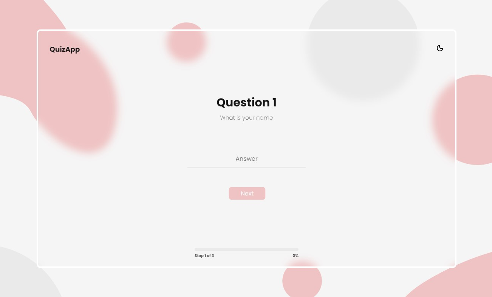
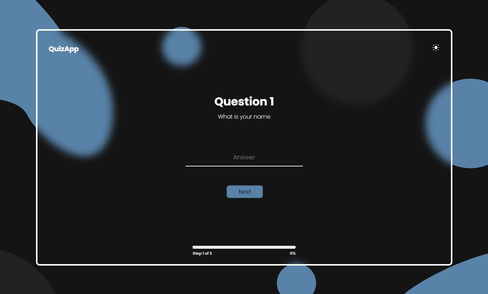

# Questionnaire App

## Exercice 02 :
### Build with ReactJS
 

## How to use (node / npm / create-react-app) :
 - Download this repo
 - cd to questionnaire app folder
 - npm install
 - npm start

 
 

### Light theme

### Dark theme

 

